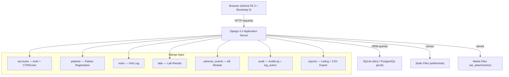
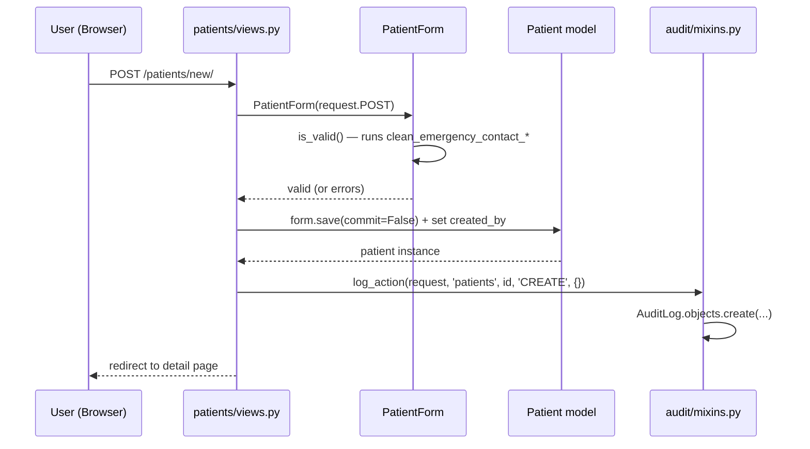
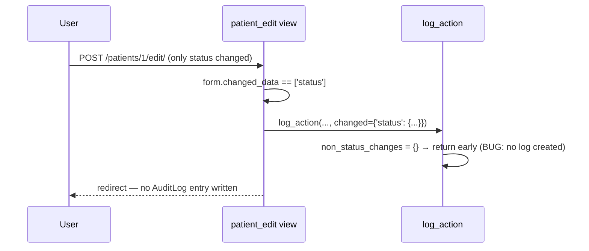
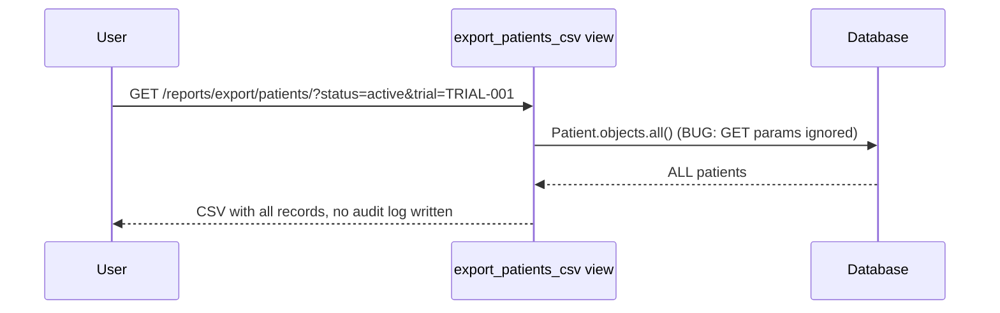

# Design Document: CTMS QA Assessment Platform

## Overview

The Clinical Trial Management System (CTMS) is a Django 4.2 web application purpose-built as a QA assessment platform. It simulates a production-grade clinical trials data management system with intentional, precisely-placed bugs across validation, audit, and data-type layers — enabling structured evaluation of QA candidates' exploratory testing and automation skills. The system manages patients, visit logs, lab results, and adverse events across four fictional clinical trials, with a full audit trail engine, CSV export, and role-based authentication.

The design preserves all 39 intentional bugs exactly as specified in the Bug Manifest. Zero accidental hardening is permitted. Every intentional gap is documented inline in the relevant code section.

## Architecture



## Sequence Diagrams

### Patient Create Flow (with audit)



### Patient Status-Change Flow (audit gap)



### CSV Export Flow (filter-ignored bug)



## Project Structure

```
ctms_project/
├── manage.py
├── requirements.txt
├── .env
├── README.md
├── Procfile                         # gunicorn for Railway/Render
├── Dockerfile                       # Option C deployment
│
├── ctms/                            # Django project package
│   ├── __init__.py
│   ├── settings.py
│   ├── urls.py
│   └── wsgi.py
│
├── accounts/
│   ├── models.py                    # CTMSUser (AbstractUser + role + employee_id)
│   ├── views.py                     # login_view, logout_view
│   ├── urls.py
│   ├── forms.py                     # CTMSLoginForm
│   └── templates/accounts/
│       └── login.html
│
├── patients/
│   ├── models.py                    # Patient — all intentional CharField bugs
│   ├── forms.py                     # PatientForm — bug layer
│   ├── views.py                     # CRUD views + detail with tabs
│   ├── urls.py
│   └── templates/patients/
│       ├── form.html
│       ├── detail.html
│       └── confirm_delete.html
│
├── visits/
│   ├── models.py                    # VisitLog — vitals as CharField
│   ├── forms.py                     # VisitForm — no cross-field validation
│   ├── views.py
│   ├── urls.py
│   └── templates/visits/
│       ├── form.html
│       └── detail.html
│
├── labs/
│   ├── models.py                    # LabResult — numeric fields as CharField
│   ├── forms.py                     # LabForm — no critical-remarks enforcement
│   ├── views.py
│   ├── urls.py
│   └── templates/labs/
│       ├── form.html
│       └── detail.html
│
├── adverse_events/
│   ├── models.py                    # AdverseEvent — unsafe file upload, SAE gap
│   ├── forms.py                     # AEForm — no SAE conditional validation
│   ├── views.py
│   ├── urls.py
│   └── templates/adverse_events/
│       ├── form.html
│       └── detail.html
│
├── reports/
│   ├── views.py                     # listing + export views (filter-ignored bug)
│   ├── urls.py
│   └── templates/reports/
│       └── listing.html
│
├── audit/
│   ├── models.py                    # AuditLog model
│   ├── mixins.py                    # log_action() with status-skip bug
│   ├── middleware.py                # (optional: request context helper)
│   └── templates/audit/
│       └── trail.html
│
├── templates/                       # Global templates
│   ├── base.html                    # AdminLTE 3 shell
│   ├── sidebar.html
│   ├── navbar.html
│   └── dashboard.html
│
├── static/
│   ├── css/ctms.css
│   └── js/ctms.js
│
└── [app]/management/commands/
    ├── seed_users.py
    └── seed_data.py
```

## Data Models

### accounts/models.py

```python
from django.contrib.auth.models import AbstractUser
from django.db import models

class CTMSUser(AbstractUser):
    ROLE_CHOICES = [('coordinator', 'Coordinator'), ('admin', 'Admin')]
    role = models.CharField(max_length=20, choices=ROLE_CHOICES, default='coordinator')
    employee_id = models.CharField(max_length=20, blank=True)

    def __str__(self):
        return f"{self.get_full_name()} ({self.role})"
```

**Validation Rules**: None beyond AbstractUser defaults. `employee_id` is optional.

---

### patients/models.py

```python
from django.db import models

GENDER_CHOICES = [('M', 'Male'), ('F', 'Female'), ('O', 'Other'), ('U', 'Unknown')]
BLOOD_GROUP_CHOICES = [
    ('A+', 'A+'), ('A-', 'A-'), ('B+', 'B+'), ('B-', 'B-'),
    ('AB+', 'AB+'), ('AB-', 'AB-'), ('O+', 'O+'), ('O-', 'O-'),
]
STATUS_CHOICES = [('active', 'Active'), ('inactive', 'Inactive'), ('withdrawn', 'Withdrawn')]
TRIAL_CHOICES = [
    ('TRIAL-001', 'Phase II Cardiology Study'),
    ('TRIAL-002', 'Oncology Immunotherapy Trial'),
    ('TRIAL-003', 'Diabetes Management Protocol'),
    ('TRIAL-004', 'Neurological Disorder Study'),
]

class Patient(models.Model):
    # Identity
    first_name = models.CharField(max_length=100)
    last_name = models.CharField(max_length=100)
    date_of_birth = models.CharField(max_length=50)           # BUG Cat-C: should be DateField
    gender = models.CharField(max_length=10, choices=GENDER_CHOICES)
    medical_record_number = models.CharField(max_length=50)   # BUG Cat-E: no format validation
    national_id = models.CharField(max_length=50)             # BUG Cat-E: accepts short values

    # Contact
    email = models.CharField(max_length=200)                  # BUG Cat-E: CharField not EmailField
    phone = models.CharField(max_length=50)                   # BUG Cat-E: accepts alphabets
    address = models.TextField(blank=True)

    # Medical
    blood_group = models.CharField(max_length=5, choices=BLOOD_GROUP_CHOICES)
    weight_kg = models.CharField(max_length=20)               # BUG Cat-D: should be DecimalField
    height_cm = models.CharField(max_length=20)               # BUG Cat-D: should be DecimalField
    diagnosis = models.TextField()                            # BUG Cat-A: blank=True in form

    # Trial
    trial_assignment = models.CharField(max_length=50, choices=TRIAL_CHOICES)
    enrollment_date = models.CharField(max_length=50)         # BUG Cat-C: should be DateField
    status = models.CharField(max_length=20, choices=STATUS_CHOICES, default='active')
    # BUG Cat-G: status change does NOT create AuditLog entry

    # Emergency Contact — BUG Cat-B: no asterisk in UI, but backend raises ValidationError
    emergency_contact_name = models.CharField(max_length=100)
    emergency_contact_phone = models.CharField(max_length=50)

    # Consent — BUG Cat-A: shown as required (*) in UI, but BooleanField(default=False) not enforced
    consent_signed = models.BooleanField(default=False)

    created_by = models.ForeignKey(
        'accounts.CTMSUser', on_delete=models.SET_NULL, null=True,
        related_name='patients_created'
    )
    created_at = models.DateTimeField(auto_now_add=True)
    updated_at = models.DateTimeField(auto_now=True)

    def __str__(self):
        return f"{self.first_name} {self.last_name} ({self.medical_record_number})"

    class Meta:
        ordering = ['-created_at']
```

---

### visits/models.py

```python
from django.db import models

VISIT_TYPE_CHOICES = [
    ('screening', 'Screening'), ('baseline', 'Baseline'),
    ('followup', 'Follow-up'), ('final', 'Final Visit'), ('unscheduled', 'Unscheduled'),
]

class VisitLog(models.Model):
    patient = models.ForeignKey('patients.Patient', on_delete=models.CASCADE, related_name='visits')
    visit_number = models.CharField(max_length=20)           # BUG Cat-E: accepts "V@#!"
    visit_date = models.CharField(max_length=50)             # BUG Cat-C: should be DateField
    visit_type = models.CharField(max_length=20, choices=VISIT_TYPE_CHOICES)
    investigator_name = models.CharField(max_length=100)
    coordinator = models.ForeignKey(
        'accounts.CTMSUser', on_delete=models.SET_NULL, null=True, related_name='visits'
    )

    # Vitals — BUG Cat-D: all CharField, should be numeric types
    systolic_bp = models.CharField(max_length=20)
    diastolic_bp = models.CharField(max_length=20)
    heart_rate = models.CharField(max_length=20)
    body_temperature = models.CharField(max_length=20)
    oxygen_saturation = models.CharField(max_length=20)

    visit_notes = models.TextField(blank=True)
    next_visit_date = models.CharField(max_length=50, blank=True)  # BUG Cat-C/F: can be before visit_date

    # Protocol Deviation
    protocol_deviation = models.BooleanField(default=False)
    deviation_notes = models.TextField(blank=True)           # BUG Cat-A/F: required in UI when deviation=True, not enforced

    created_by = models.ForeignKey(
        'accounts.CTMSUser', on_delete=models.SET_NULL, null=True, related_name='visits_created'
    )
    created_at = models.DateTimeField(auto_now_add=True)
    updated_at = models.DateTimeField(auto_now=True)

    class Meta:
        ordering = ['-created_at']
```

---

### labs/models.py

```python
from django.db import models

SAMPLE_TYPE_CHOICES = [('blood', 'Blood'), ('urine', 'Urine'), ('tissue', 'Tissue'), ('csf', 'CSF')]
ABNORMAL_FLAG_CHOICES = [('normal', 'Normal'), ('abnormal', 'Abnormal'), ('critical', 'Critical')]

class LabResult(models.Model):
    patient = models.ForeignKey('patients.Patient', on_delete=models.CASCADE, related_name='lab_results')
    visit = models.ForeignKey('visits.VisitLog', on_delete=models.SET_NULL, null=True, blank=True, related_name='lab_results')

    sample_collection_date = models.CharField(max_length=50)  # BUG Cat-C: accepts "00/00/0000"
    sample_type = models.CharField(max_length=20, choices=SAMPLE_TYPE_CHOICES)
    test_name = models.CharField(max_length=200)

    result_value = models.CharField(max_length=100)           # BUG Cat-D: accepts "positive"
    unit = models.CharField(max_length=50)                    # BUG Cat-D: free text
    reference_range_low = models.CharField(max_length=50)     # BUG Cat-D: accepts alphabets
    reference_range_high = models.CharField(max_length=50)    # BUG Cat-D: accepts alphabets

    abnormal_flag = models.CharField(max_length=20, choices=ABNORMAL_FLAG_CHOICES, default='normal')
    lab_technician = models.CharField(max_length=100)
    lab_name = models.CharField(max_length=200)
    remarks = models.TextField(blank=True)                    # BUG Cat-F: if flag=Critical, should require remarks

    created_by = models.ForeignKey(
        'accounts.CTMSUser', on_delete=models.SET_NULL, null=True, related_name='labs_created'
    )
    created_at = models.DateTimeField(auto_now_add=True)
    updated_at = models.DateTimeField(auto_now=True)

    class Meta:
        ordering = ['-created_at']
```

---

### adverse_events/models.py

```python
from django.db import models

SEVERITY_CHOICES = [
    ('mild', 'Mild'), ('moderate', 'Moderate'),
    ('severe', 'Severe'), ('life_threatening', 'Life-Threatening'),
]
CAUSALITY_CHOICES = [
    ('related', 'Related'), ('unrelated', 'Unrelated'),
    ('possible', 'Possible'), ('probable', 'Probable'),
]
ACTION_CHOICES = [
    ('none', 'None'), ('dose_reduced', 'Dose Reduced'),
    ('drug_stopped', 'Drug Stopped'), ('hospitalized', 'Hospitalized'),
]
OUTCOME_CHOICES = [
    ('recovered', 'Recovered'), ('recovering', 'Recovering'),
    ('ongoing', 'Ongoing'), ('fatal', 'Fatal'), ('unknown', 'Unknown'),
]

class AdverseEvent(models.Model):
    patient = models.ForeignKey('patients.Patient', on_delete=models.CASCADE, related_name='adverse_events')
    event_title = models.CharField(max_length=200)
    onset_date = models.CharField(max_length=50)             # BUG Cat-C: accepts garbage
    resolution_date = models.CharField(max_length=50, blank=True)  # BUG Cat-C/F: can be before onset_date
    severity = models.CharField(max_length=20, choices=SEVERITY_CHOICES)
    causality = models.CharField(max_length=20, choices=CAUSALITY_CHOICES)
    event_description = models.TextField(blank=True)         # BUG Cat-A: required in UI, saves without

    action_taken = models.CharField(max_length=20, choices=ACTION_CHOICES)
    outcome = models.CharField(max_length=20, choices=OUTCOME_CHOICES)

    is_sae = models.BooleanField(default=False)
    sae_report_number = models.CharField(max_length=50, blank=True)  # BUG Cat-A/F: required if SAE=True in UI, not enforced

    reported_by = models.CharField(max_length=100)
    report_date = models.CharField(max_length=50)            # BUG Cat-C: accepts future dates
    regulatory_reported = models.BooleanField(default=False)

    attachment = models.FileField(upload_to='ae_attachments/', blank=True, null=True)
    # BUG: No file type validation — accepts .exe, .js, .bat, .sh

    created_by = models.ForeignKey(
        'accounts.CTMSUser', on_delete=models.SET_NULL, null=True, related_name='ae_created'
    )
    created_at = models.DateTimeField(auto_now_add=True)
    updated_at = models.DateTimeField(auto_now=True)

    class Meta:
        ordering = ['-created_at']
```

---

### audit/models.py

```python
from django.db import models

ACTION_CHOICES = [
    ('CREATE', 'Create'), ('UPDATE', 'Update'), ('DELETE', 'Delete'),
    ('LOGIN', 'Login'), ('LOGOUT', 'Logout'), ('EXPORT', 'Export'),
]

class AuditLog(models.Model):
    timestamp = models.DateTimeField(auto_now_add=True)
    user = models.ForeignKey(
        'accounts.CTMSUser', on_delete=models.SET_NULL,
        null=True, related_name='audit_logs'
    )
    module = models.CharField(max_length=50)
    record_id = models.IntegerField(null=True, blank=True)
    action = models.CharField(max_length=10, choices=ACTION_CHOICES)
    reason = models.TextField(blank=True)
    changed_fields = models.JSONField(default=dict)
    ip_address = models.GenericIPAddressField(null=True, blank=True)
    user_agent = models.CharField(max_length=500, blank=True)
    # BUG Cat-G: Status-only changes on Patient module are silently skipped in log_action()

    class Meta:
        ordering = ['-timestamp']
```

## Components and Interfaces

### Component 1: accounts — Authentication

**Purpose**: Custom user model and login/logout views. Intentional gaps: failed logins not logged, "Remember Me" is cosmetic.

**Interface**:
```python
# accounts/views.py
def login_view(request) -> HttpResponse
    # BUG Cat-G: failed login NOT logged to AuditLog
    # BUG Cat-H: "Remember Me" checkbox has no effect on SESSION_COOKIE_AGE

def logout_view(request) -> HttpResponseRedirect
    # Logs LOGOUT action to AuditLog (this one IS logged)
```

**settings.py auth config**:
```python
AUTH_USER_MODEL = 'accounts.CTMSUser'
SESSION_COOKIE_AGE = 1800           # 30 min inactivity timeout
SESSION_SAVE_EVERY_REQUEST = True   # resets timer on activity
SESSION_EXPIRE_AT_BROWSER_CLOSE = True
LOGIN_URL = '/login/'
LOGIN_REDIRECT_URL = '/dashboard/'
LOGOUT_REDIRECT_URL = '/login/'
```

---

### Component 2: patients — Patient Registration

**Purpose**: Full CRUD for patient records. Bug layer is in `forms.py` and the audit mixin call in `views.py`.

**Interface**:
```python
# patients/views.py
@login_required
def patient_create(request) -> HttpResponse

@login_required
def patient_detail(request, pk: int) -> HttpResponse
    # Shows tabbed sub-sections: Visits | Lab Results | Adverse Events | Audit Trail

@login_required
def patient_edit(request, pk: int) -> HttpResponse
    # BUG Cat-G: calls log_action() but status-only changes are silently skipped inside it

@login_required
def patient_delete(request, pk: int) -> HttpResponse
```

**PatientForm key behaviors**:
```python
class PatientForm(forms.ModelForm):
    consent_signed = forms.BooleanField(required=False)  # BUG Cat-A

    # BUG Cat-B: no asterisk in template, but these raise ValidationError
    def clean_emergency_contact_name(self): ...
    def clean_emergency_contact_phone(self): ...

    # All date fields: TextInput + Flatpickr widget (cosmetic) — BUG Cat-C
    # All numeric fields: TextInput (type="text") — BUG Cat-D
    # Format hint fields: placeholder only, no RegexValidator — BUG Cat-E
    # No clean() cross-field validation — BUG Cat-F
    # email field: TextInput not EmailInput — BUG Cat-E
    # diagnosis: blank allowed in form despite UI asterisk — BUG Cat-A
```

---

### Component 3: visits — Visit Log

**Purpose**: CRUD for visit records linked to patients. Vitals stored as plain text.

**Interface**:
```python
# visits/views.py
@login_required
def visit_create(request) -> HttpResponse

@login_required
def visit_detail(request, pk: int) -> HttpResponse

@login_required
def visit_edit(request, pk: int) -> HttpResponse

@login_required
def visit_delete(request, pk: int) -> HttpResponse
```

**VisitForm key behaviors**:
```python
class VisitForm(forms.ModelForm):
    # All vitals: TextInput (type="text"), no MinValueValidator — BUG Cat-D
    # visit_number: placeholder "Format: V-001", no RegexValidator — BUG Cat-E
    # visit_date / next_visit_date: TextInput + Flatpickr — BUG Cat-C
    # No clean() to compare next_visit_date > visit_date — BUG Cat-F
    # deviation_notes: blank=True, no cross-field check when protocol_deviation=True — BUG Cat-A/F
    # coordinator: Select filtered to CTMSUser queryset
```

---

### Component 4: labs — Lab Results

**Purpose**: CRUD for lab results linked to patients and optionally to visits.

**LabForm key behaviors**:
```python
class LabForm(forms.ModelForm):
    # result_value, reference_range_low, reference_range_high: TextInput — BUG Cat-D
    # unit: free TextInput, should be controlled dropdown — BUG Cat-D
    # sample_collection_date: TextInput + Flatpickr — BUG Cat-C
    # No clean() to enforce remarks when abnormal_flag == 'critical' — BUG Cat-F
```

---

### Component 5: adverse_events — Adverse Events

**Purpose**: CRUD for adverse events. Contains SAE conditional gap and unsafe file upload.

**AEForm key behaviors**:
```python
class AdverseEventForm(forms.ModelForm):
    # event_description: blank=True, UI shows (*) — BUG Cat-A
    # sae_report_number: blank=True, JS shows (*) when is_sae=True, no clean() — BUG Cat-A/F
    # onset_date / resolution_date / report_date: TextInput + Flatpickr — BUG Cat-C
    # No clean() to compare resolution_date > onset_date — BUG Cat-F
    # attachment: FileField with no allowed_extensions validation — BUG (unsafe upload)
```

---

### Component 6: audit — Audit Trail Engine

**Purpose**: Central logging for all CREATE/UPDATE/DELETE/LOGIN/LOGOUT actions. Contains intentional status-change skip.

**Interface**:
```python
# audit/mixins.py
def log_action(
    request,
    module: str,
    record_id: int,
    action: str,
    changed_fields: dict,
    reason: str = ''
) -> None:
    """
    INTENTIONAL BUG Cat-G:
    If module == 'patients' AND action == 'UPDATE'
    AND changed_fields contains ONLY 'status' key,
    function returns early without creating AuditLog entry.
    """
    if module == 'patients' and action == 'UPDATE':
        non_status_changes = {k: v for k, v in changed_fields.items() if k != 'status'}
        if not non_status_changes:
            return  # Silent skip

    AuditLog.objects.create(
        user=request.user,
        module=module,
        record_id=record_id,
        action=action,
        reason=reason,
        changed_fields=changed_fields,
        ip_address=...,
        user_agent=...
    )
```

**Audit Trail View**:
- URL: `/audit/` — full trail with filters (date range, user, module, action)
- URL: `/audit/patient/<patient_id>/` — per-patient trail
- URL: `/audit/module/<module_name>/` — per-module trail
- Columns: Timestamp, User, Module, Record ID, Action (colored badge), Reason, Changed Fields (expandable JSON diff), IP Address
- Note: Status changes on Patient will not appear — this is the intentional gap

---

### Component 7: reports — Patient Listing + CSV Export

**Purpose**: Searchable/filterable patient listing with DataTables, plus CSV export for all modules.

**Interface**:
```python
# reports/views.py
@login_required
def patient_listing(request) -> HttpResponse
    # Supports GET params: search, status, trial, gender
    # DataTables handles client-side pagination/sort

@login_required
def export_patients_csv(request) -> HttpResponse
    # BUG Cat-H: ignores all GET params — exports Patient.objects.all()
    # BUG Cat-G: no log_action() call — export not audited

@login_required
def export_visits_csv(request) -> HttpResponse
    # BUG Cat-H: exports VisitLog.objects.all()

@login_required
def export_labs_csv(request) -> HttpResponse
    # BUG Cat-H: exports LabResult.objects.all()

@login_required
def export_ae_csv(request) -> HttpResponse
    # BUG Cat-H: exports AdverseEvent.objects.all()

@login_required
def export_audit_csv(request) -> HttpResponse
    # Exports AuditLog — irony: this export itself is not logged
```

**Export field lists** (excluded fields are intentional — privacy/internal):

| Export | Excluded Fields |
|--------|----------------|
| Patients | national_id, address, emergency_contact_*, consent_signed, created_by |
| Visits | visit_notes, deviation_notes, coordinator, created_by |
| Labs | remarks, lab_technician, visit (FK), created_by |
| Adverse Events | event_description, attachment, reported_by, created_by |
| Audit Trail | changed_fields JSON, user_agent |

## Algorithmic Pseudocode

### Main: log_action() with Status-Skip Bug

```pascal
PROCEDURE log_action(request, module, record_id, action, changed_fields, reason)
  INPUT: request, module: String, record_id: Int, action: String,
         changed_fields: Dict, reason: String
  OUTPUT: None (side effect: AuditLog row created, or silently skipped)

  BEGIN
    // INTENTIONAL BUG Cat-G: status-only changes on patients are not logged
    IF module = 'patients' AND action = 'UPDATE' THEN
      non_status_changes ← {k: v FOR k, v IN changed_fields IF k ≠ 'status'}
      IF non_status_changes IS EMPTY THEN
        RETURN  // Silent skip — no log entry created
      END IF
    END IF

    ip ← request.META['HTTP_X_FORWARDED_FOR'] OR request.META['REMOTE_ADDR']

    AuditLog.objects.create(
      user        = request.user,
      module      = module,
      record_id   = record_id,
      action      = action,
      reason      = reason,
      changed_fields = changed_fields,
      ip_address  = ip[:45],
      user_agent  = request.META['HTTP_USER_AGENT'][:500]
    )
  END
END PROCEDURE
```

**Preconditions:**
- `request.user` is authenticated
- `module` is one of: patients, visits, labs, adverse_events
- `action` is one of: CREATE, UPDATE, DELETE, LOGIN, LOGOUT, EXPORT

**Postconditions:**
- If module='patients', action='UPDATE', and changed_fields contains only 'status': no AuditLog row is created (intentional bug)
- Otherwise: exactly one AuditLog row is created with all provided fields

---

### Main: export_patients_csv() with Filter-Ignore Bug

```pascal
PROCEDURE export_patients_csv(request)
  INPUT: request (may contain GET params: status, trial, gender, search)
  OUTPUT: HttpResponse with CSV content

  BEGIN
    response ← HttpResponse(content_type='text/csv')
    response['Content-Disposition'] ← 'attachment; filename="patients_export.csv"'

    writer ← csv.writer(response)
    writer.writerow(PATIENT_EXPORT_HEADERS)

    // INTENTIONAL BUG Cat-H: GET params are completely ignored
    patients ← Patient.objects.all()   // Always fetches ALL records

    FOR each patient IN patients DO
      writer.writerow([getattr(patient, field) FOR field IN PATIENT_EXPORT_FIELDS])
    END FOR

    // INTENTIONAL BUG Cat-G: No log_action() call here

    RETURN response
  END
END PROCEDURE
```

**Preconditions:** User is authenticated

**Postconditions:**
- CSV response is returned with all Patient records regardless of any filter state
- No AuditLog entry is created for this export action

---

### Main: patient_edit() with Audit Gap

```pascal
PROCEDURE patient_edit(request, pk)
  INPUT: request, pk: Int
  OUTPUT: HttpResponse

  BEGIN
    patient ← get_object_or_404(Patient, pk=pk)

    IF request.method = 'POST' THEN
      reason ← request.POST.get('edit_reason', '')
      // BUG Cat-H: reason is only enforced by frontend JS modal, not here
      form ← PatientForm(request.POST, instance=patient)

      IF form.is_valid() THEN
        old_data ← {f: getattr(patient, f) FOR f IN form.changed_data}
        form.save()
        new_data ← {f: getattr(patient, f) FOR f IN form.changed_data}
        changed ← {f: {old: old_data[f], new: new_data[f]} FOR f IN form.changed_data}

        // log_action is called, but if changed = {status: ...} only,
        // it will silently return without writing a log — BUG Cat-G
        log_action(request, 'patients', patient.id, 'UPDATE', changed, reason=reason)

        RETURN redirect('patients:detail', pk=patient.pk)
      END IF
    END IF

    RETURN render('patients/form.html', {form, patient, title})
  END
END PROCEDURE
```

---

### Main: login_view() with Missing Failure Logging

```pascal
PROCEDURE login_view(request)
  INPUT: request
  OUTPUT: HttpResponse

  BEGIN
    IF request.method = 'POST' THEN
      form ← CTMSLoginForm(request.POST)
      username ← request.POST.get('username')
      password ← request.POST.get('password')
      user ← authenticate(username=username, password=password)

      IF user IS NOT NULL THEN
        login(request, user)
        log_action(request, 'accounts', user.id, 'LOGIN', {})
        RETURN redirect(LOGIN_REDIRECT_URL)
      ELSE
        // INTENTIONAL BUG Cat-G: failed login NOT logged
        // No AuditLog.objects.create() here
        form.add_error(None, "Invalid username or password.")
      END IF

      // BUG Cat-H: "Remember Me" checkbox value is read but has no effect
    END IF

    RETURN render('accounts/login.html', {form})
  END
END PROCEDURE
```

## UI & Template Structure

### base.html (AdminLTE 3 Shell)

```
<!DOCTYPE html>
<html>
<head>
  AdminLTE 3 CSS, Bootstrap 5, Font Awesome 6
  Flatpickr CSS, Select2 CSS, DataTables CSS, Toastr CSS
  ctms.css (custom overrides)
</head>
<body class="hold-transition sidebar-mini layout-fixed">
  <div class="wrapper">
    
    
    <div class="content-wrapper">
      
    </div>
    <footer>CTMS v2.1.0 | Confidential — For Internal Use Only | © 2025 ClinTrials Corp</footer>
  </div>
  AdminLTE JS, Bootstrap 5 JS, jQuery
  Flatpickr JS, Select2 JS, SweetAlert2 JS, DataTables JS, Toastr JS
  ctms.js (reason modals, conditional field show/hide)
</body>
</html>
```

### sidebar.html

```
CTMS Logo + "v2.1.0" tag
─────────────────────────
🏠 Dashboard                    → /dashboard/
─────────────────────────────────
👥 Patients
   └── Register New Patient     → /patients/new/
   └── All Patients             → /reports/
📋 Visit Logs
   └── Add Visit                → /visits/new/
   └── All Visits               → /visits/
🧪 Lab Results
   └── Add Lab Result           → /labs/new/
   └── All Lab Results          → /labs/
⚠️  Adverse Events
   └── Report Event             → /adverse-events/new/
   └── All Events               → /adverse-events/
─────────────────────────────────
📊 Reports & Export             → /reports/
🔍 Audit Trail                  → /audit/
─────────────────────────────────
👤 [Username] — [Role]
🚪 Logout                       → /logout/
```

### dashboard.html

```
Top Row — 4 Stat Cards:
  [Total Patients: XX]  [Active Trials: 4]  [Open AEs: XX]  [Visits This Month: XX]

Middle Row (2 columns):
  Recent Patients table (last 5 registered) — MRN, Name, Trial, Status
  Recent Adverse Events (last 5) — Patient, Event, Severity (colored badge)

Bottom Row — Quick Actions:
  [+ Register Patient]  [+ Log Visit]  [+ Report AE]  [View Audit Trail]
```

### Form Template Pattern (all modules)

```html


<div class="card">
  <div class="card-header">
    <h3>{{ title }}</h3>
  </div>
  <div class="card-body">
    <form method="post" enctype="multipart/form-data">
      
      <!-- Sections rendered with Bootstrap 5 grid -->
      <!-- Required fields show asterisk (*) in label -->
      <!-- Emergency Contact section: NO asterisk (BUG Cat-B) -->
      <!-- Flatpickr initialized on date fields via JS -->
      <!-- Select2 initialized on patient/coordinator dropdowns -->
      <!-- Protocol Deviation: JS shows/hides deviation_notes -->
      <!-- SAE checkbox: JS shows/hides sae_report_number -->
    </form>
  </div>
</div>

```

### Reason Modal (SweetAlert2 — ctms.js)

```javascript
// Triggered on Edit and Delete button clicks
// BUG Cat-H: reason is enforced by JS only — backend does NOT validate reason is non-empty

function showEditReasonModal(formId) {
    Swal.fire({
        title: 'Reason for Edit',
        input: 'textarea',
        inputPlaceholder: 'Please provide a reason for modifying this record.',
        showCancelButton: true,
        confirmButtonText: 'Confirm Edit',
        preConfirm: (reason) => {
            if (!reason) Swal.showValidationMessage('Reason is required');
        }
    }).then((result) => {
        if (result.isConfirmed) {
            document.getElementById('edit_reason').value = result.value;
            document.getElementById(formId).submit();
        }
    });
}
// NOTE: Direct form POST bypasses this modal entirely — backend saves without reason
```

### Status Badges (ctms.css)

```css
.badge-active    { background: #28a745; color: white; }
.badge-inactive  { background: #6c757d; color: white; }
.badge-withdrawn { background: #dc3545; color: white; }
.badge-critical  { background: #dc3545; color: white; }
.badge-abnormal  { background: #ffc107; color: black; }
.badge-normal    { background: #28a745; color: white; }
```

### Patient Detail Page (tabbed)

```
/patients/<pk>/
├── Patient info cards (read-only, all fields)
└── Tabs:
    ├── Visits (count badge) — table of linked VisitLog records + Add New
    ├── Lab Results (count badge) — table of linked LabResult records + Add New
    ├── Adverse Events (count badge) — table of linked AdverseEvent records + Add New
    └── Audit Trail (count badge) — filtered AuditLog for this patient
```

### Patient Listing Page (reports/listing.html)

```
/reports/
├── Top bar: Search input + Status dropdown + Trial dropdown + Gender dropdown + Export CSV button
├── DataTables table (25 per page default, sortable columns)
│   Columns: MRN | Patient Name | DOB | Gender | Trial | Enrollment Date | Status | Actions
└── Actions per row: View | Edit | Delete (with reason modal)

BUG Cat-H: Export CSV button calls /reports/export/patients/ which ignores all active filters
```

## Bug Manifest Reference

This is the complete master reference for all 39 intentional bugs. These MUST be preserved exactly — zero accidental hardening.

### Category A — UI Shows Required (*), Backend Does NOT Enforce (5 bugs)

| Module | Field | Implementation |
|--------|-------|----------------|
| Patient | consent_signed | `forms.BooleanField(required=False)` — checkbox can be unchecked |
| Patient | diagnosis | `blank=True` in PatientForm Meta (model has `TextField()` without blank) |
| Visit | deviation_notes | `blank=True` in model; no `clean()` cross-field check |
| Adverse Event | event_description | `blank=True` in model |
| Adverse Event | sae_report_number | `blank=True` in model; JS shows (*) when is_sae=True but no `clean()` |

### Category B — UI Shows NO Required Indicator, Backend Rejects (2 bugs)

| Module | Field | Implementation |
|--------|-------|----------------|
| Patient | emergency_contact_name | `clean_emergency_contact_name()` raises ValidationError; NO asterisk in template |
| Patient | emergency_contact_phone | `clean_emergency_contact_phone()` raises ValidationError; NO asterisk in template |

### Category C — Date Fields Accept Any String (8 bugs)

All implemented as `models.CharField(max_length=50)` with Flatpickr widget (cosmetic only — can be bypassed by typing directly):

| Module | Field |
|--------|-------|
| Patient | date_of_birth |
| Patient | enrollment_date |
| Visit | visit_date |
| Visit | next_visit_date |
| Lab | sample_collection_date |
| Adverse Event | onset_date |
| Adverse Event | resolution_date |
| Adverse Event | report_date |

### Category D — Numeric Fields as Plain Textboxes (10 bugs)

All implemented as `models.CharField(max_length=20)` with `TextInput` widget (type="text", no `type="number"`):

| Module | Field | Should Be |
|--------|-------|-----------|
| Patient | weight_kg | DecimalField min=1 max=500 |
| Patient | height_cm | DecimalField min=50 max=250 |
| Visit | systolic_bp | IntegerField range 60–250 |
| Visit | diastolic_bp | IntegerField range 40–150 |
| Visit | heart_rate | IntegerField range 30–250 |
| Visit | body_temperature | DecimalField range 35–42 |
| Visit | oxygen_saturation | IntegerField range 70–100 |
| Lab | result_value | DecimalField |
| Lab | reference_range_low | DecimalField |
| Lab | reference_range_high | DecimalField |

### Category E — Format Validation Bypasses (5 bugs)

Placeholder/hint shown in UI, no backend `RegexValidator` or `EmailValidator`:

| Module | Field | Placeholder Shown | Accepts |
|--------|-------|-------------------|---------|
| Patient | medical_record_number | "Format: MRN-000000" | Any string |
| Patient | national_id | "Enter 10–12 digit national ID" | Any 1+ char string |
| Patient | email | "patient@example.com" (type="text") | "xyz@@", "notanemail" |
| Patient | phone | "10-digit phone number" | Alphabets, symbols |
| Visit | visit_number | "Format: V-001" | "V@#!", "VISIT!!!" |

### Category F — Logic / Cross-field Validation Missing (4 bugs)

No `clean()` method implements these checks:

| Bug | Where | Missing Check |
|-----|-------|---------------|
| Date order | AdverseEventForm | `resolution_date >= onset_date` |
| Next visit order | VisitForm | `next_visit_date >= visit_date` |
| SAE conditional | AdverseEventForm | `if is_sae: require sae_report_number` |
| Deviation conditional | VisitForm | `if protocol_deviation: require deviation_notes` |
| Critical remarks | LabForm | `if abnormal_flag == 'critical': require remarks` |

### Category G — Audit Trail Gaps (3 bugs)

| Gap | Location | Implementation |
|-----|----------|----------------|
| Status change not logged | `audit/mixins.py` `log_action()` | Early return when `changed_fields` contains only `'status'` key |
| Export not logged | `reports/views.py` all export views | No `log_action()` call in any export function |
| Failed login not logged | `accounts/views.py` `login_view()` | No `AuditLog.objects.create()` in the `else` branch |

### Category H — Export & UI Bugs (2 bugs)

| Bug | Location | Implementation |
|-----|----------|----------------|
| Export ignores filters | `reports/views.py` | `Patient.objects.all()` — GET params never read |
| Remember Me is cosmetic | `accounts/templates/login.html` | Checkbox rendered but value never used in view |

---

## Seed Data Strategy

### management/commands/seed_users.py

Creates 3 users:
```python
# admin@ctms.com / Admin@123 — superuser, Admin role
# coordinator1@ctms.com / Coord@123 — Coordinator role
# coordinator2@ctms.com / Coord@123 — Coordinator role
```

### management/commands/seed_data.py

Creates realistic demo data that demonstrates the bugs are working:

**10 Patients** (mix of statuses and trials):
- Patient 3: `weight_kg = "obese"` — demonstrates Cat-D bug
- Patient 5: `date_of_birth = "01/00/1990"` — demonstrates Cat-C bug
- Patient 7: `consent_signed = False` — demonstrates Cat-A bug
- Patient 9: `email = "xyz@@domain"` — demonstrates Cat-E bug

**30 Visits** (3 per patient):
- Some with `protocol_deviation=True` and `deviation_notes=""` — demonstrates Cat-A/F bug
- Some with `systolic_bp="normal"` — demonstrates Cat-D bug

**20 Lab Results** (2 per patient):
- Some with `abnormal_flag="critical"` and `remarks=""` — demonstrates Cat-F bug
- Some with `result_value="positive"` — demonstrates Cat-D bug

**5 Adverse Events**:
- 2 with `is_sae=True` and `sae_report_number=""` — demonstrates Cat-A/F bug
- 1 with `resolution_date` before `onset_date` — demonstrates Cat-F bug
- 1 with `event_description=""` — demonstrates Cat-A bug

**Audit Logs**: Auto-generated from seeding creates. Status changes intentionally absent.

---

## Error Handling

### Form Validation Errors

All forms use Django's standard form error rendering. Errors appear inline below each field using Bootstrap 5 `is-invalid` class and `invalid-feedback` div.

**Key error scenarios**:
- Emergency contact fields: error appears after submit with no prior UI indication (Cat-B)
- All other required fields: standard Django required field error
- No custom error messages for format/type violations (they don't exist — that's the bug)

### 404 / Permission Errors

- All CRUD views use `get_object_or_404` — returns Django's 404 page
- All views decorated with `@login_required` — unauthenticated users redirected to `/login/`
- No role-based access control beyond login requirement (coordinators can access all records)

### Session Expiry

- After 30 minutes of inactivity: redirect to `/login/` with message "Your session has expired."
- Implemented via `SESSION_COOKIE_AGE = 1800` and `SESSION_SAVE_EVERY_REQUEST = True`

---

## Testing Strategy

### Unit Testing Approach

Test each form's intentional validation gaps to confirm bugs are preserved:
- `PatientForm`: confirm `consent_signed=False` passes validation
- `PatientForm`: confirm `diagnosis=""` passes validation
- `PatientForm`: confirm `weight_kg="heavy"` passes validation
- `VisitForm`: confirm `deviation_notes=""` with `protocol_deviation=True` passes
- `LabForm`: confirm `remarks=""` with `abnormal_flag="critical"` passes
- `AdverseEventForm`: confirm `sae_report_number=""` with `is_sae=True` passes

### Property-Based Testing Approach

**Property Test Library**: pytest + hypothesis

Key properties to verify:
- For any string value `s`, `PatientForm` with `weight_kg=s` is valid (no numeric enforcement)
- For any string value `s`, `VisitForm` with `visit_date=s` is valid (no date enforcement)
- For any string value `s`, `PatientForm` with `email=s` is valid (no email enforcement)

### Integration Testing Approach (Playwright)

QA candidate assessment targets:
- At least 3 complete CRUD flows
- Form validation scenarios (positive and negative)
- At least 1 audit trail verification
- Scripts runnable with: `pytest tests/`

---

## Performance Considerations

- DataTables.js handles client-side pagination/sorting — no server-side pagination needed for assessment scale (10–100 records)
- `Patient.objects.all()` in export views is intentionally unoptimized (part of the bug design)
- `select_related` should be used on audit trail queries to avoid N+1 on user FK

---

## Security Considerations

The following are **intentional security gaps** for QA assessment purposes. They must NOT be fixed:

- Unsafe file upload: `AdverseEvent.attachment` accepts any file type including `.exe`, `.js`, `.bat`
- No account lockout after failed login attempts
- Backend reason validation missing (only JS-enforced)
- Email field stored as CharField (no format enforcement)

Standard Django security that IS in place:
- CSRF protection on all forms (``)
- `@login_required` on all views
- Django's built-in password hashing (PBKDF2)
- `SECRET_KEY` loaded from `.env` via `python-decouple`

---

## Dependencies

### requirements.txt

```
Django==4.2.13
python-decouple==3.8
whitenoise==6.6.0
gunicorn==21.2.0
Pillow==10.3.0
django-environ==0.11.2
```

### Frontend CDN (loaded in base.html)

```
AdminLTE 3.2.0
Bootstrap 5.3
Font Awesome 6 Free
Flatpickr 4.6.13
Select2 4.1.0
SweetAlert2 11
DataTables 1.13
Toastr 2.1.4
jQuery 3.7 (required by AdminLTE/DataTables)
```

---

## Deployment

### Option A — Local Development

```bash
python -m venv venv
source venv/bin/activate
pip install -r requirements.txt
cp .env.example .env          # set SECRET_KEY, DEBUG=True
python manage.py migrate
python manage.py seed_users
python manage.py seed_data
python manage.py runserver
# Candidate URL: http://localhost:8000
# Login: coordinator1@ctms.com / Coord@123
```

### Option B — Railway / Render (Free Cloud)

```bash
# Procfile
web: gunicorn ctms.wsgi --log-file -

# Environment variables:
SECRET_KEY=your-secret-key-here
DEBUG=False
ALLOWED_HOSTS=your-app.railway.app
DATABASE_URL=sqlite:///db.sqlite3
```

### Option C — Docker

```dockerfile
FROM python:3.11-slim
WORKDIR /app
COPY requirements.txt .
RUN pip install -r requirements.txt
COPY . .
RUN python manage.py migrate && \
    python manage.py seed_users && \
    python manage.py seed_data
CMD ["gunicorn", "ctms.wsgi:application", "--bind", "0.0.0.0:8000"]
```

```bash
docker build -t ctms .
docker run -p 8000:8000 ctms
```

---

## Correctness Properties

*A property is a characteristic or behavior that should hold true across all valid executions of a system — essentially, a formal statement about what the system should do. Properties serve as the bridge between human-readable specifications and machine-verifiable correctness guarantees.*

The following properties define the system's intentional behavior. They are stated as invariants that MUST hold after implementation — any deviation means a bug was accidentally fixed.

### Property 1: Consent bypass

*For any* patient record submission where `consent_signed=False`, the PatientForm SHALL pass validation and the record SHALL save successfully.

**Validates: Requirements 3.9**

### Property 2: Diagnosis bypass

*For any* patient record submission where `diagnosis=""`, the PatientForm SHALL pass validation and the record SHALL save successfully.

**Validates: Requirements 3.10**

### Property 3: Numeric field bypass — vitals

*For any* string value `s`, a VisitForm with `systolic_bp=s` (and all other required fields valid) SHALL pass validation without numeric or range enforcement.

**Validates: Requirements 5.7, 5.8, 5.9, 5.10, 5.11**

### Property 4: Date field bypass — patient

*For any* string value `s`, a PatientForm with `date_of_birth=s` (and all other required fields valid) SHALL pass validation without date format enforcement.

**Validates: Requirements 3.1, 3.2**

### Property 5: Email field bypass

*For any* string value `s`, a PatientForm with `email=s` (and all other required fields valid) SHALL pass validation without email format enforcement.

**Validates: Requirements 3.5**

### Property 6: Status-only change audit gap

*For any* patient record edit where only the `status` field changes, the Audit_System SHALL NOT create a new AuditLog entry — the count of UPDATE entries for that patient SHALL remain unchanged.

**Validates: Requirements 4.1, 4.3, 8.3**

### Property 7: Export filter gap

*For any* set of GET parameters passed to `export_patients_csv`, the response SHALL contain all Patient records in the database regardless of the filter values.

**Validates: Requirements 9.3, 9.4**

### Property 8: Export audit gap

*For any* CSV export call across all export endpoints, the AuditLog entry count for action=EXPORT SHALL NOT increase.

**Validates: Requirements 8.4, 9.3**

### Property 9: SAE report number bypass

*For any* AdverseEvent submission where `is_sae=True` and `sae_report_number=""`, the AdverseEventForm SHALL pass validation and the record SHALL save successfully.

**Validates: Requirements 7.9**

### Property 10: Critical remarks bypass

*For any* LabResult submission where `abnormal_flag='critical'` and `remarks=""`, the LabForm SHALL pass validation and the record SHALL save successfully.

**Validates: Requirements 6.9**

### Property 11: Failed login audit gap

*For any* failed login attempt with any username/password combination, the Audit_System SHALL NOT create an AuditLog entry.

**Validates: Requirements 1.4, 8.5**

### Property 12: Date field bypass — all modules

*For any* string value `s`, date fields across VisitForm (`visit_date`, `next_visit_date`), LabForm (`sample_collection_date`), and AdverseEventForm (`onset_date`, `resolution_date`, `report_date`) SHALL accept `s` without date format validation.

**Validates: Requirements 5.4, 5.5, 6.4, 7.4, 7.5, 7.6**

### Property 13: Date order bypass — adverse events

*For any* AdverseEvent submission where `resolution_date` is chronologically before `onset_date`, the AdverseEventForm SHALL pass validation and the record SHALL save successfully.

**Validates: Requirements 7.7**

### Property 14: Protocol deviation conditional bypass

*For any* VisitLog submission where `protocol_deviation=True` and `deviation_notes=""`, the VisitForm SHALL pass validation and the record SHALL save successfully.

**Validates: Requirements 5.12**
